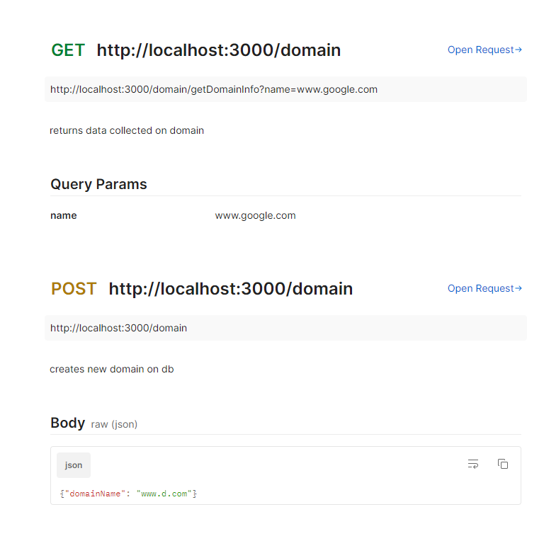

<p align="center">
  <a href="http://nestjs.com/" target="blank"></a>
</p>

[circleci-image]: https://img.shields.io/circleci/build/github/nestjs/nest/master?token=abc123def456
[circleci-url]: https://circleci.com/gh/nestjs/nest

  <p align="center">A progressive <a href="http://nodejs.org" target="_blank">Node.js</a> framework for building efficient and scalable server-side applications.</p>
    <p align="center">
<a href="https://www.npmjs.com/~nestjscore" target="_blank"></a>
<a href="https://www.npmjs.com/~nestjscore" target="_blank"></a>
<a href="https://www.npmjs.com/~nestjscore" target="_blank"></a>
<a href="https://circleci.com/gh/nestjs/nest" target="_blank"></a>
<a href="https://coveralls.io/github/nestjs/nest?branch=master" target="_blank"></a>
<a href="https://discord.gg/G7Qnnhy" target="_blank"></a>
<a href="https://opencollective.com/nest#backer" target="_blank"></a>
<a href="https://opencollective.com/nest#sponsor" target="_blank"></a>
  <a href="https://paypal.me/kamilmysliwiec" target="_blank"></a>
    <a href="https://opencollective.com/nest#sponsor"  target="_blank"></a>
  <a href="https://twitter.com/nestframework" target="_blank"></a>
</p>
  <!--[](https://opencollective.com/nest#backer)
  [](https://opencollective.com/nest#sponsor)-->

## Description
This a NestJs application with sql database which collects data on domains 
every 1st of the month the system will gather data on it's domains and save it for your use.

## Design
app is composed of 3 modules -
1. domain module- incharge on the domains creation
2. domain scans module- incharge of scanning the domains and saving the data we have gathered
3. recent domain scans module- incharge of updating the latest data collected

## API'S


[Nest](https://github.com/nestjs/nest) framework TypeScript starter repository.
## DB Creation
please run the following scripts

CREATE DATABASE `app_schema` /*!40100 DEFAULT CHARACTER SET utf8mb4 COLLATE utf8mb4_0900_ai_ci */ /*!80016 DEFAULT ENCRYPTION='N' */;

CREATE TABLE `domain` (
  `id` int NOT NULL AUTO_INCREMENT,
  `domain_name` varchar(100) NOT NULL,
  `createdAt` timestamp(6) NOT NULL DEFAULT CURRENT_TIMESTAMP(6),
  PRIMARY KEY (`id`),
  UNIQUE KEY `domain_name_UNIQUE` (`domain_name`)
) ENGINE=InnoDB AUTO_INCREMENT=17 DEFAULT CHARSET=utf8mb4 COLLATE=utf8mb4_0900_ai_ci;

CREATE TABLE `domain_scans` (
  `id` int NOT NULL AUTO_INCREMENT,
  `data` varchar(6000) DEFAULT NULL,
  `createdAt` timestamp(6) NULL DEFAULT CURRENT_TIMESTAMP(6),
  `source` varchar(45) DEFAULT NULL,
  `domainId` int DEFAULT NULL,
  PRIMARY KEY (`id`),
  KEY `domain_id_idx` (`domainId`),
  CONSTRAINT `domain_id` FOREIGN KEY (`domainId`) REFERENCES `domain` (`id`)
) ENGINE=InnoDB AUTO_INCREMENT=844 DEFAULT CHARSET=utf8mb4 COLLATE=utf8mb4_0900_ai_ci;

CREATE TABLE `recent_domain_scan` (
  `id` int NOT NULL AUTO_INCREMENT,
  `data` varchar(6000) DEFAULT NULL,
  `createdAt` timestamp(6) NULL DEFAULT CURRENT_TIMESTAMP(6),
  `updatedAt` timestamp(6) NULL DEFAULT CURRENT_TIMESTAMP(6),
  `source` varchar(45) DEFAULT NULL,
  `domainId` int DEFAULT NULL,
  PRIMARY KEY (`id`),
  KEY `domain_id_idx` (`domainId`),
  CONSTRAINT `domain_idx` FOREIGN KEY (`domainId`) REFERENCES `domain` (`id`)
) ENGINE=InnoDB AUTO_INCREMENT=41 DEFAULT CHARSET=utf8mb4 COLLATE=utf8mb4_0900_ai_ci;


## Installation

```bash
$ npm install
```

## Running the app

```bash
# development
$ npm run start

# watch mode
$ npm run start:dev

# production mode
$ npm run start:prod
```

## Test

```bash
# unit tests
$ npm run test

# e2e tests
$ npm run test:e2e

# test coverage
$ npm run test:cov
```

## Support

Nest is an MIT-licensed open source project. It can grow thanks to the sponsors and support by the amazing backers. If you'd like to join them, please [read more here](https://docs.nestjs.com/support).

## Stay in touch

- Author - [Kamil Myśliwiec](https://kamilmysliwiec.com)
- Website - [https://nestjs.com](https://nestjs.com/)
- Twitter - [@nestframework](https://twitter.com/nestframework)

## License

Nest is [MIT licensed](LICENSE).
